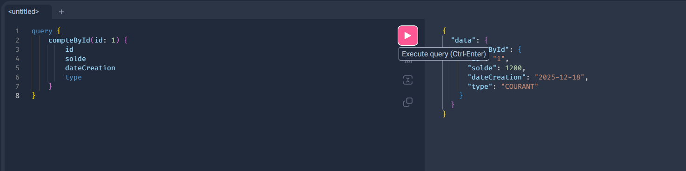
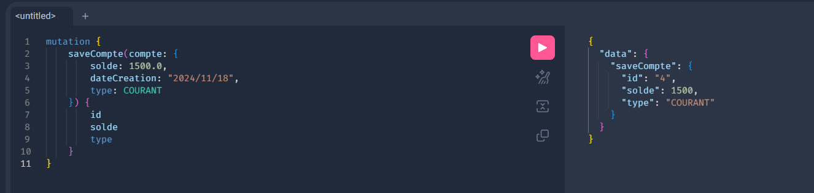
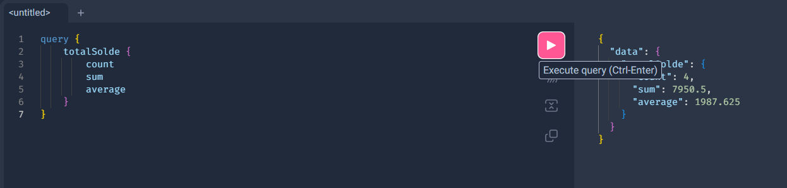

# TP_15 - Application de Gestion Bancaire avec GraphQL

## 📋 Description

Application Spring Boot utilisant GraphQL pour gérer des comptes bancaires et leurs transactions. Le projet implémente une API GraphQL complète avec des opérations de lecture (Query) et d'écriture (Mutation) pour la gestion de comptes et de transactions financières.

## 🛠️ Technologies Utilisées

- **Spring Boot 4.0.0** - Framework Java
- **Spring Data JPA** - Persistance des données
- **GraphQL** - API GraphQL avec Spring GraphQL
- **H2 Database** - Base de données en mémoire
- **Lombok** - Réduction du code boilerplate
- **Java 17** - Version du JDK

## 📦 Structure du Projet

```
src/main/java/com/example/tp_15/
├── entities/
│   ├── Compte.java              # Entité représentant un compte bancaire
│   ├── TypeCompte.java          # Enum: COURANT, EPARGNE
│   ├── Transaction.java         # Entité représentant une transaction
│   └── TypeTransaction.java     # Enum: DEPOT, RETRAIT
├── repositories/
│   ├── CompteRepository.java    # Repository JPA pour les comptes
│   └── TransactionRepository.java # Repository JPA pour les transactions
├── controllers/
│   ├── CompteControllerGraphQL.java    # Contrôleur GraphQL
│   └── GraphQLExceptionHandler.java    # Gestion des erreurs GraphQL
└── Tp15Application.java         # Classe principale avec initialisation des données
```

## 🗂️ Modèle de Données

### Entité Compte
```java
@Entity
public class Compte {
    @Id @GeneratedValue
    private Long id;
    private double solde;
    @Temporal(TemporalType.DATE)
    private Date dateCreation;
    @Enumerated(EnumType.STRING)
    private TypeCompte type; // COURANT ou EPARGNE
}
```

### Entité Transaction
```java
@Entity
public class Transaction {
    @Id @GeneratedValue
    private Long id;
    private double montant;
    @Temporal(TemporalType.TIMESTAMP)
    private Date date;
    @Enumerated(EnumType.STRING)
    private TypeTransaction type; // DEPOT ou RETRAIT
    @ManyToOne
    private Compte compte;
}
```

## 🚀 Démarrage

### Prérequis
- Java 17 ou supérieur
- Maven 3.6+

### Installation et Exécution

1. **Cloner le projet**
```bash
git clone <repository-url>
cd TP_15
```

2. **Compiler le projet**
```bash
mvnw clean install
```

3. **Lancer l'application**
```bash
mvnw spring-boot:run
```

4. **Accéder aux interfaces**
- GraphiQL Interface: http://localhost:8082/graphiql
- H2 Console: http://localhost:8082/h2-console
  - JDBC URL: `jdbc:h2:mem:banque`
  - Username: `sa`
  - Password: _(vide)_

## 📊 API GraphQL

### Schéma GraphQL

#### Types Énumérés
```graphql
enum TypeCompte {
    COURANT
    EPARGNE
}

enum TypeTransaction {
    DEPOT
    RETRAIT
}
```

### Queries (Lectures)

#### 1. Récupérer tous les comptes
```graphql
query {
    allComptes {
        id
        solde
        dateCreation
        type
    }
}
```

#### 2. Récupérer un compte par ID
```graphql
query {
    compteById(id: 1) {
        id
        solde
        dateCreation
        type
    }
}
```

#### 3. Statistiques globales des soldes
```graphql
query {
    totalSolde {
        count    # Nombre total de comptes
        sum      # Somme de tous les soldes
        average  # Moyenne des soldes
    }
}
```

#### 4. Récupérer les transactions d'un compte
```graphql
query {
    compteTransactions(id: 1) {
        id
        montant
        date
        type
        compte {
            id
            solde
        }
    }
}
```

#### 5. Statistiques des transactions
```graphql
query {
    transactionStats {
        count        # Nombre total de transactions
        sumDepots    # Somme des dépôts
        sumRetraits  # Somme des retraits
    }
}
```

### Mutations (Écritures)

#### 1. Créer un nouveau compte
```graphql
mutation {
    saveCompte(compte: {
        solde: 1000.0
        dateCreation: "2024-12-18"
        type: COURANT
    }) {
        id
        solde
        dateCreation
        type
    }
}
```

#### 2. Ajouter une transaction
```graphql
mutation {
    addTransaction(transaction: {
        compteId: 1
        montant: 500.0
        date: "2024-12-18"
        type: DEPOT
    }) {
        id
        montant
        date
        type
        compte {
            id
            solde
        }
    }
}
```

## 🔧 Configuration

Le fichier `application.properties` contient la configuration suivante:

```properties
spring.application.name=TP_15
server.port=8082

# Configuration H2
spring.datasource.url=jdbc:h2:mem:banque
spring.datasource.driverClassName=org.h2.Driver
spring.datasource.username=sa
spring.datasource.password=

# Configuration JPA
spring.jpa.database-platform=org.hibernate.dialect.H2Dialect
spring.jpa.hibernate.ddl-auto=update

# Console H2
spring.h2.console.enabled=true
spring.h2.console.path=/h2-console

# GraphiQL
spring.graphql.graphiql.enabled=true
```

## 💾 Données Initiales

Au démarrage, l'application initialise automatiquement:

**3 Comptes:**
- Compte 1: 1200.0 € (COURANT)
- Compte 2: 5000.0 € (EPARGNE)
- Compte 3: 250.5 € (COURANT)

**3 Transactions:**
- Dépôt de 200.0 € sur le compte 1
- Retrait de 50.0 € sur le compte 1
- Dépôt de 400.0 € sur le compte 2

## 🎯 Fonctionnalités

### Gestion des Comptes
- ✅ Création de comptes (COURANT/EPARGNE)
- ✅ Consultation de tous les comptes
- ✅ Consultation d'un compte par ID
- ✅ Calcul des statistiques (nombre, somme, moyenne des soldes)

### Gestion des Transactions
- ✅ Ajout de transactions (DEPOT/RETRAIT)
- ✅ Consultation des transactions par compte
- ✅ Statistiques globales des transactions
- ✅ Calcul automatique des sommes par type

### Gestion des Erreurs
- ✅ Gestion personnalisée des erreurs GraphQL
- ✅ Messages d'erreur clairs pour les comptes introuvables
- ✅ Validation des données via GraphQL schema

## 📸 Captures d'écran

### Opérations sur les Comptes


*Récupération de la liste complète des comptes*


*Consultation d'un compte spécifique par son ID*


*Requête paramétrée pour récupérer un compte*


*Mutation pour créer un nouveau compte*


*Statistiques globales des soldes*

### Opérations sur les Transactions


*Mutation pour ajouter une transaction à un compte*


*Consultation des transactions d'un compte spécifique*


*Statistiques sur l'ensemble des transactions*

## 🔍 Points Techniques

### Architecture
- **Pattern Repository**: Séparation de la logique métier et de l'accès aux données
- **DTOs**: Utilisation de `TransactionRequest` et `CompteRequest` pour les inputs GraphQL
- **Lombok**: Génération automatique des getters/setters avec `@Data`
- **JPA Relations**: Relation `@ManyToOne` entre Transaction et Compte

### Particularités GraphQL
- Schema-first approach avec `schema.graphqls`
- `@QueryMapping` pour les requêtes de lecture
- `@MutationMapping` pour les opérations d'écriture
- `@Argument` pour mapper les paramètres GraphQL
- Gestion d'erreurs personnalisée avec `DataFetcherExceptionResolverAdapter`

### Base de Données
- H2 en mémoire pour le développement
- Initialisation automatique via `CommandLineRunner`
- Migrations automatiques avec `ddl-auto=update`

## 📝 Améliorations Possibles

- [ ] Ajouter la mise à jour des soldes lors des transactions
- [ ] Implémenter la suppression de comptes et transactions
- [ ] Ajouter des validations métier (solde minimum, montants positifs)
- [ ] Implémenter la pagination pour les listes
- [ ] Ajouter des filtres avancés (par date, par montant)
- [ ] Sécuriser l'API avec Spring Security
- [ ] Ajouter des tests unitaires et d'intégration
- [ ] Migrer vers une base de données persistante (PostgreSQL/MySQL)
- [ ] Ajouter des subscriptions GraphQL pour les notifications en temps réel

## 👨‍💻 Auteur

Projet réalisé dans le cadre du TP_15 - Gestion Bancaire avec GraphQL

## 📄 Licence

Ce projet est à usage éducatif.
